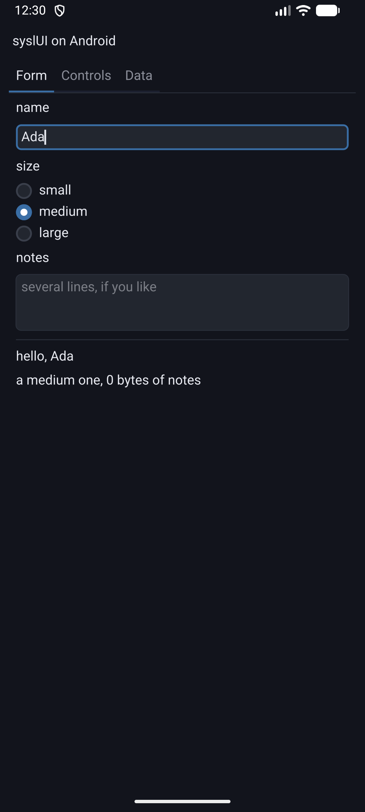
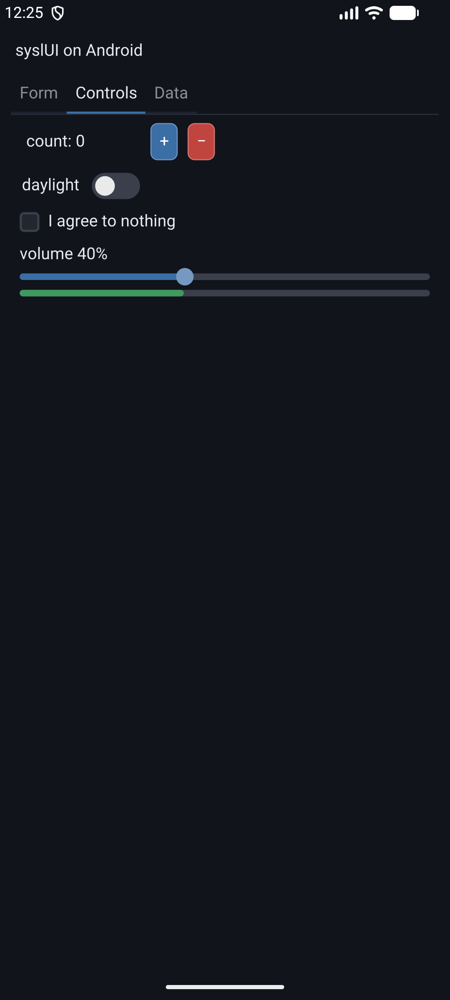

# syslui-android

**syslUI on a phone.** A form with a text field, a text area, radio buttons and a keyboard that comes
up when you tap into one — drawn by PlutoVG into a block of pixels, handed to SDL3 as one texture,
and running on Android with no C in the repository at all.



The second tab is the controls, which are the same ones the desktop demo has and needed nothing
added to run here.



Both are screenshots off a running emulator, not renderings.

## What it is for

`sysl-lang/syslui-demo` is the toolkit's desktop demo. This is the same toolkit on the other kind of
machine, and it exists to answer three questions that a desktop cannot:

- **Does a tap work where a mouse press did?** It did not, and finding that out is what this
  repository is for. Focus was taken by a field noticing `pressed(r)` while it painted, which works
  with a mouse only because a mouse press lasts several frames — a tap is a press and a release
  arriving *between* two frames, so no field could ever be typed into. syslUI records the press now
  and reports it for exactly the frame that follows (`Canvas.tapped`).
- **Does the toolkit link when Gradle owns the link?** It did not: `sysl build-c` refused the whole
  package, because an `@export`ed `SDL_main` reaching computed module storage has no `main` to run
  the initializer that fills it. The write counter is a bare `var` now.
- **Is it legible at a phone's density?** Only if somebody scales it, and that somebody is the
  application — see below.

Both fixes are in `sysl-lang/syslui`, and neither could have been found by a test in that package.

## Building it

You need Android Studio's SDK with the **NDK** and **CMake** installed (SDK Manager → SDK Tools), a
**JDK between 17 and 25**, `ANDROID_HOME` set, and a clone of **`sysl-lang/syslui` beside this
repository** — the toolkit is private, so it is reached by `--lib` rather than by coordinate and
CMake stops with a message naming the path if it is not there.

```
export ANDROID_HOME=~/Library/Android/sdk
./fetch-sdl3.sh
./gradlew assembleDebug
adb install -r app/build/outputs/apk/debug/app-debug.apk
adb shell am start -n sh.sysl.syslui/.MainActivity
```

**It needs a sysl newer than 0.0.61**, which is the first that knows `aarch64-android`, and plutovg
`0.2.1` or newer, which is the first with a texture paint. `sysl targets` lists what a compiler has.

An emulator works and an arm64 one is required: sysl has one Android target. On an Apple Silicon
machine the ordinary system images are arm64 already.

## The three things a phone does differently

Everything below is in `syslui-android/main.sysl`, about thirty lines of it, and **none of it is in
the toolkit**. `sh.sysl.ui` has no scale factor, no orientation and no insets, and that is the split
working: a toolkit that had guessed at any of them would have to be told it was wrong on every device
that disagreed.

- **The density.** The tree is built and measured in *points*; the canvas is scaled by
  `window.display_scale()` before anything is drawn, so a rounded corner and a glyph are rasterized
  at the pixel size they end up at. Scaling the finished picture instead would be one bilinear blur
  over the whole interface. A laptop answers 1.0 or 2.0 there and a phone about 2.75.

  **A touch is reported in window units and the drawing is in pixels**, and on a high-density
  display those are not the same — so the ratio is measured from `size_in_pixels` against `size`
  rather than assumed, and then divided by the scale again to land in points.

- **The system bars.** From API 35 an app draws edge to edge whether it asks to or not.
  `window.safe_area()` is the obvious answer and the wrong rectangle: SDL builds it out of five inset
  types at once because it answers *where can a button go*, which on a gesture-navigation phone is 78
  pixels off each side. So `MainActivity` reads `WindowInsets.Type.systemBars()` and calls a native
  method **defined in sysl** — the `@export("Java_sh_sysl_syslui_MainActivity_nativeSetSystemBars")`
  in `main.sysl` — and the interface is laid out in what is left.

- **The keyboard is something you ask for.** `window.start_text_input()` raises it and
  `stop_text_input()` puts it away, and what decides is `c.focus()`: the id of whichever field has
  the keys, or `NOBODY`. Four lines in the frame loop, no view involved in either, and the toolkit
  never learns that a soft keyboard exists.

  **Typed text arrives as a `TextInput` event, already composed**, which is why a field takes a run
  of text rather than a character: a phone's suggestion bar inserts whole words, and an accent or a
  CJK composition never arrives any other way. `key_of` maps the dozen keys an editing surface cares
  about — the arrows, the two deletes, home, end, enter, tab — and answers `None` for everything
  else, so a shortcut stays the program's.

## How the two halves are joined

**Gradle owns the link, so the arrangement is upside down from an ordinary sysl build**: `sysl
build-c` compiles the program to an archive and CMake links it into the `libmain.so` the APK carries.

| file | what it does |
|---|---|
| `syslui-android/main.sysl` | the whole program — both exports, the screen, the frame loop |
| `app/src/main/cpp/CMakeLists.txt` | runs `sysl build-c`, links the archive into `libmain.so` |
| `activity/src/main/scala/…/MainActivity.scala` | an `SDLActivity` subclass in **Scala**, which reads the insets |
| `activity/build.sbt` | compiles it — AGP has no Scala support, so sbt does and Gradle takes the jar |
| `app/build.gradle.kts` | `prefab true`, one ABI, the pinned NDK |
| `fetch-sdl3.sh` | downloads the SDL3 AAR |

**Five things in there are load-bearing and silent when wrong.** Four are androidkit's and are
written up in that repository: `-u SDL_main` in the link options, the library being called `main`,
`--include-path sdl3=<dir>` named rather than bare, and `ANDROID_NDK_ROOT` handed to `sysl build-c`.

The fifth is this repository's own: **the toolkit's sources are dependencies of the archive.** A
`--lib` tree is compiled into the program like any other module, so leaving it out of `DEPENDS`
produces an APK with the old toolkit in it and nothing at all to say so — which happened here, once,
between a fix and the build that was supposed to prove it.

## Licence

ISC, like the rest of the org. SDL3 is zlib and PlutoVG is MIT; neither is carried here.
